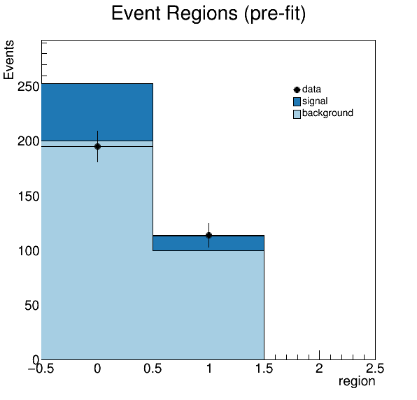
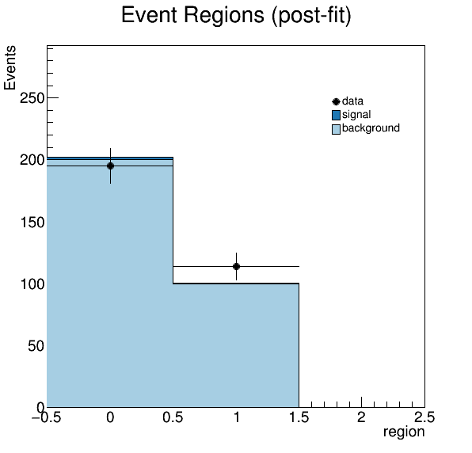
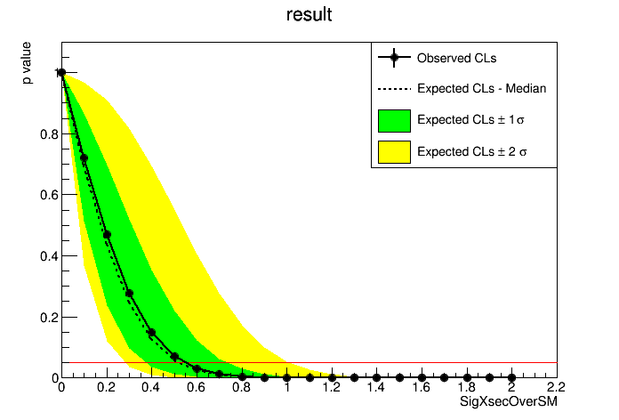

# Statistical Analysis for an ATLAS analysis

This is a simple repository for statistical analysis for outputs produced by the event selection package. 

Notes:

* The `make_ws.py` script generates a HistFactory configuration based on signal,data and background ROOT files
* It performs a simgple HistFactory-based fit based on a single channel (consisting of two bins).

```

## Usage

```bash
source /home/atlas/release_setup.sh
python make_ws.py {data_file} {signal_file} {background_file}
python plot.py results/meas_combined_meas_model.root {pre_plot} {post_plot}
python set_limit.py results/meas_combined_meas_model.root {limit_plot} {limit_data} {limit_data_nomsignal}
```


## Example Results

Pre and Post-fit plots




---
Limit Plots



Limit Data is also stored in JSON format for both an entire µ-scan, as well as for µ=1
